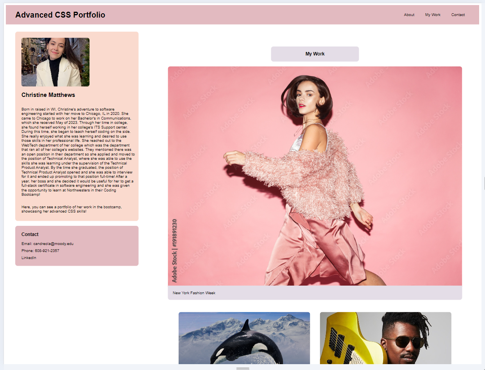

# Homework--module-2-Matthews
My Advanced CSS Portfolio

## Description
This project is designed to showcase Christine's Advanced CSS Skills. Note, each link is a placeholder that will eventually showcase actually work she's done, but for now it is to showcase her ability to turn images into buttons. 

## Installation
N/A

## Usage
Each image link will take a user to another website to signfy different applications Christine has worked on. A user can read about Christine's journey to software engineering and find ways to contact her as well!

## Screenshot

## Link

<a href="https://cmatthews3212.github.io/Homework--module-2-Matthews/"> https://cmatthews3212.github.io/Homework--module-2-Matthews/ </a>

## Credits
N/A

## License
Please refer to the LICENSE in the repo.

## Badges
N/A

## Features
N/A

## How to Contribute
N/A

## Tests
N/A
